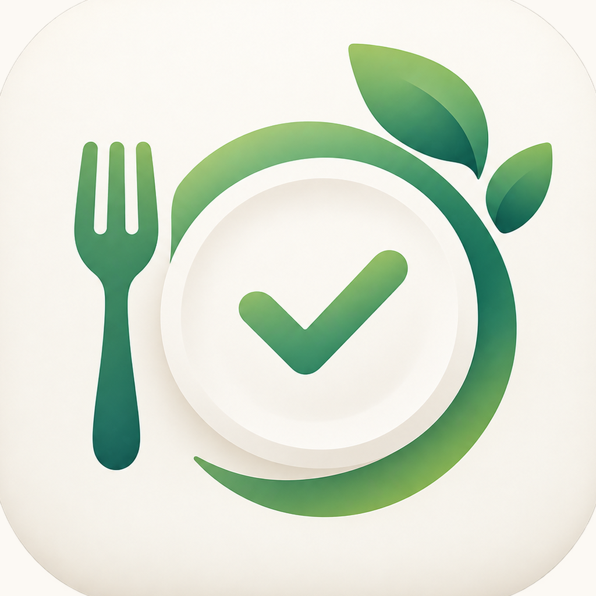

  

<h1 align="center">NutriRoutine</h1>

  <strong>La dieta del tuo nutrizionista, sempre a portata di mano</strong>

  
  
  
  
  
  
  
  
  
  

  <em>In arrivo sull'App Store</em>

---

## Descrizione

NutriRoutine è un'app iOS gratuita per **seguire la dieta settimanale che ti ha dato il tuo nutrizionista**: cinque pasti al giorno, orari, alimenti e quantità, con il prossimo pasto sempre in vista sulla schermata di blocco e nella Dynamic Island.

Non crea diete e non dà consigli: organizza e ti ricorda il piano che hai ricevuto da un professionista. Accanto alla dieta gestisce la spesa, la dispensa, l'acqua, il peso con i controlli e la scheda di allenamento.

> NutriRoutine non sostituisce il medico o il nutrizionista. Leggi le [avvertenze mediche e nutrizionali](DISCLAIMER.md).

## Funzionalità

### Dieta
- Inserimento guidato della dieta settimanale, giorno per giorno, con ricerca tra circa 2.000 alimenti italiani, porzioni, crudo e cotto
- Oggi: il pasto imminente con conto alla rovescia, pulsante **Mangiato** (annullabile), sostituzioni secondo le regole del nutrizionista, sgarri
- Vista Settimana e Giorno, pasti da registrare, dettaglio di ogni pasto
- **Valori nutrizionali** indicativi della giornata e di ogni pasto (kcal, proteine, carboidrati, grassi), con le fonti
- **Gestione diete**: dieta attiva con riepilogo, archivio con "Usa di nuovo", export e import in file `.nutriroutine`

### Live Activity, widget e notifiche
- **Live Activity** del prossimo pasto su schermata di blocco e Dynamic Island, con "Mangiato" e "+1 bicchiere" senza aprire l'app
- Widget per la Home e la schermata di blocco
- Promemoria dei pasti con azioni rapide: Mangiato, Posticipa, Aggiungi i mancanti alla spesa
- Comandi Siri e Comandi Rapidi

### Spesa e dispensa
- **Prepara la spesa** per oggi, domani, tre giorni o la settimana: spunti quello che hai già e confermi, il resto entra in lista con il giorno e il pasto in cui serve
- Lista per giorno o per reparto, condivisione, promemoria per andare a fare la spesa
- **Dispensa come magazzino**: le quantità comprate si sommano, quelle mangiate si scalano, "sta finendo" quando la scorta cala

### Bevi
- Obiettivo giornaliero, bicchieri con un tocco, promemoria intelligenti nella fascia oraria scelta

### Peso e controlli
- Peso di partenza, attuale e variazione, grafico dell'andamento
- Registro dei controlli con il nutrizionista, promemoria il giorno prima
- Pesate e controlli correggibili in qualsiasi momento

### Allenamento
- Schede con esercizi a ripetizioni o a tempo, serie, recuperi, carico e note
- Esecuzione a tutto schermo con timer di serie e recupero, suono e vibrazione a fine passo
- **"Bevi un sorso"** durante il recupero e Live Activity dell'allenamento

### Sempre
- Nessun account, nessuna pubblicità, nessuna raccolta di dati: tutto resta sul dispositivo
- Backup completo in un file per passare a un altro iPhone
- Italiano e inglese, VoiceOver, Dynamic Type, modalità chiara e scura, iPhone e iPad

## Privacy

I dati restano sul tuo dispositivo e, se attivi la sincronizzazione, nel tuo iCloud privato. Non vengono inviati a nessun server esterno. La [Privacy Policy](PRIVACY.md) completa è disponibile in questo repository.

## Contatti

Per supporto, segnalazioni o suggerimenti: [Issues](https://github.com/dindonio/nutriroutine-release/issues)

---

  <em>NutriRoutine, by Antonio Scognamiglio. © 2026</em>

